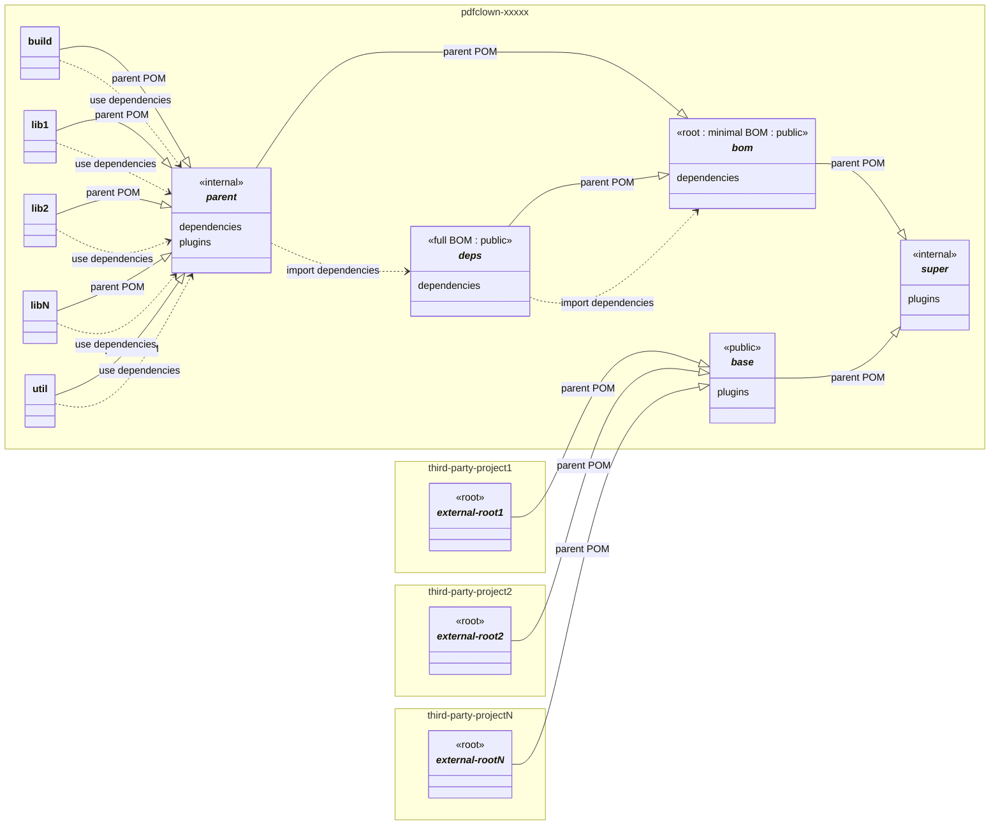

```mermaid
classDiagram
    direction LR
    namespace pdfclown-xxxxx {
      class _base_ {
          <<public>>
          plugins
      }
      class _bom_ {
          <<root : minimal BOM : public>>
          dependencies
      }
      class build
      class _deps_ {
          <<full BOM : public>>
          dependencies
      }
      class lib1
      class lib2
      class libN
      class _parent_ {
          <<internal>>
          dependencies
          plugins
      }
      class _super_ {
          <<internal>>
          plugins
      }
      class util
    }
    namespace third-party-project1 {
      class _external-root1_{
          <<root>>
      }
    }
    namespace third-party-project2 {
      class _external-root2_{
          <<root>>
      }
    }
    namespace third-party-projectN {
      class _external-rootN_{
          <<root>>
      }
    }

    %% Inheritance relationships (child --|> parent)
    _bom_ --|> _super_ : parent POM
    _deps_ --|> _bom_ : parent POM
    _parent_ --|> _bom_ : parent POM
    _base_ --|> _super_ : parent POM
    build --|> _parent_ : parent POM
    util --|> _parent_ : parent POM
    lib1 --|> _parent_ : parent POM
    lib2 --|> _parent_ : parent POM
    libN --|> _parent_ : parent POM
    _external-root1_ --|> _base_ : parent POM
    _external-root2_ --|> _base_ : parent POM
    _external-rootN_ --|> _base_ : parent POM

    %% Dependency imports, usages and other relationships
    _parent_ ..> _deps_ : import dependencies
    _deps_ ..> _bom_ : import dependencies
    build ..> _parent_ : use dependencies
    util ..> _parent_ : use dependencies
    lib1 ..> _parent_ : use dependencies
    lib2 ..> _parent_ : use dependencies
    libN ..> _parent_ : use dependencies
```
