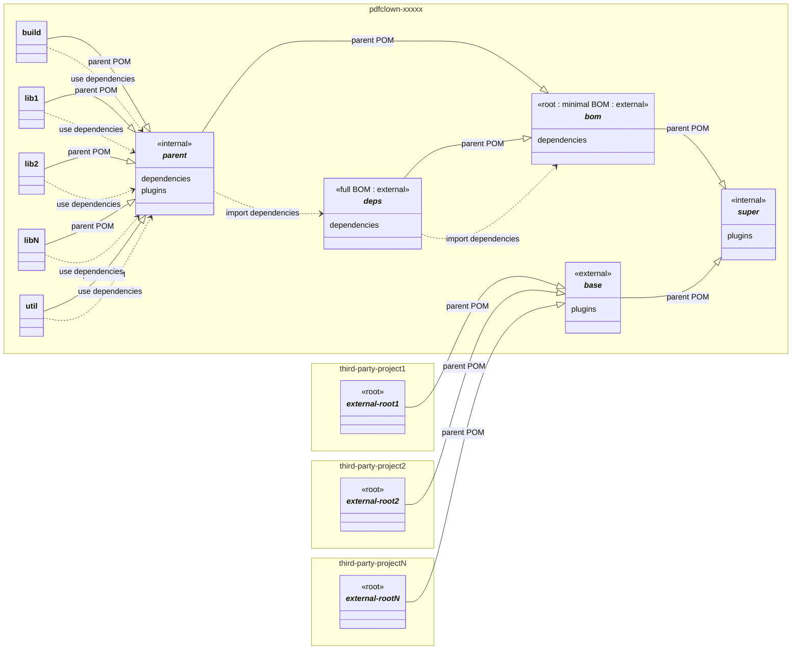

<!--
  SPDX-FileCopyrightText: 2025 Stefano Chizzolini and contributors

  SPDX-License-Identifier: CC-BY-SA-4.0
-->

[Project Conventions](conventions.md) >

# Project Structure

## Filesystem structure

The filesystem structure of pdfClown.org projects SHALL follow [Maven's Standard Directory Layout](https://maven.apache.org/guides/introduction/introduction-to-the-standard-directory-layout.html).

For clarity, [subproject directory names MUST match the `project/artifactID` element](https://www.sonatype.com/blog/2011/01/maven-tip-project-directories-and-artifact-ids) in their respective pom.xml; the same applies to the `project/name` element:

    <name>${project.artifactId}</name>

## Project Hierarchy

A pdfClown.org project SHALL be defined according to this hierarchy (initially drafted via [Copilot](https://github.com/copilot/share/820d121c-42e4-8cb2-b011-1a0be4ce2032)):

**Legend:**
- _italic style_ denotes **subprojects with "pom" packaging** (assimilated to abstract classes)
- `<<internal>>` stereotype denotes **private artifacts** (i.e., not published, consumed only internally to the project hierarchy)
- `<<external>>` stereotype denotes **published artifacts** (i.e., consumed also externally to the project hierarchy)
- properties represent **declarations** (e.g. `dependencies`, `plugins`)
- `--|>` arrows represent **Maven `parent` (inheritance) relationships**, pointing from child to parent
- `..>` dashed arrows represent **Maven dependencies usage** (import or regular)

<table>
<tr>
  <th>Name</th>
  <th>Role</th>
  <th>Description</th>
  <th>Published</th>
</tr>
<tr>
  <td><code>base</code></td>
  <td>:wrench: external parent</td>
  <td>Build configuration meant to be reused <i>outside</i> the project hierarchy via inheritance; inherits from the same subproject as <code>bom</code>.  Example: <a href="../pdfclown-common-base/pom.xml"><code>pdfclown-common-base</code></a></td>
  <td>:heavy_check_mark:</td>
</tr>
<tr>
  <td rowspan="2"><code>bom</code></td>
  <td>:gear: minimal BOM</td>
  <td rowspan="2">Declares its subprojects (Maven reactor) and the corresponding dependencies, meant to be reused via import; any third-party dependency is declared by <code>deps</code>; any build configuration is inherited from either <code>super</code> (if present) or a parent external to the project hierarchy.  Example: <a href="../pom.xml"><code>pdfclown-common-bom</code></a></td>
  <td>:heavy_check_mark:</td>
</tr>
<tr>
  <td>:wrench: root project</td>
  <td>:x:</td>
</tr>
<tr>
  <td><code>build</code></td>
  <td>:package: concrete artifact</td>
  <td>Library providing common configuration, resources and utilities for the building process.  Example: <a href="../pdfclown-common-build/pom.xml"><code>pdfclown-common-build</code></a></td>
  <td>:heavy_check_mark:</td>
</tr>
<tr>
  <td><code>deps</code></td>
  <td>:gear: full BOM</td>
  <td>Declares <i>all</i> the dependency used in the project hierarchy, including those in <code>bom</code>.  Example: <a href="../pdfclown-common-deps/pom.xml"><code>pdfclown-common-deps</code></a></td>
  <td>:heavy_check_mark:</td>
</tr>
<tr>
  <td><code>parent</code></td>
  <td>:wrench::gear: internal parent</td>
  <td>Build configuration and dependencies meant to be reused <i>inside</i> the project hierarchy via inheritance by all the concrete subprojects.  Example: <a href="../pdfclown-common-parent/pom.xml"><code>pdfclown-common-parent</code></a></td>
  <td>:x:</td>
</tr>
<tr>
  <td rowspan="2"><code>super</code></td>
  <td>:wrench: external super&#x2011;parent</td>
  <td>Build configuration meant to be inherited by <code>base</code> to expose the configuration to external projects.  Example: <a href="../pdfclown-common-super/pom.xml"><code>pdfclown-common-super</code></a></td>
  <td rowspan="2">:x:&dagger;</td>
</tr>
<tr>
  <td>:wrench: internal super&#x2011;parent</td>
  <td>Build configuration meant to be inherited by <code>bom</code> as an alternative to a parent from an external project, if the latter is missing or has to be customized (in such case, the parent from an external project is inherited by <code>super</code>).  Example: <a href="../pdfclown-common-super/pom.xml"><code>pdfclown-common-super</code></a></td>
</tr>
<tr>
  <td><code>util</code></td>
  <td>:package: concrete artifact</td>
  <td>Library providing common utilities.  Example: <a href="../pdfclown-common-util/pom.xml"><code>pdfclown-common-util</code></a></td>
  <td>:heavy_check_mark:</td>
</tr>
<tr>
  <td><code>(lib*)</code></td>
  <td>:package: concrete artifacts</td>
  <td>Any other concrete (i.e., without "pom" packaging) subproject <i>inside</i> the project hierarchy.</td>
  <td>:heavy_check_mark:</td>
</tr>
<tr>
  <th colspan="4">External projects</th>
</tr>
<tr>
  <td><code>(external&#x2011;root*)</code></td>
  <td>:wrench: external children</td>
  <td>Root projects <i>outside</i> the project hierarchy (i.e., external projects consuming the published <code>base</code> subproject).</td>
  <td>N/A</td>
</tr>
</table>
&dagger; Currently, because of technical limitations in Maven toolset, it is transitively inherited outside the project (ideally, it should be flattened inside <code>base</code> and not published).

### Rationale

The notorious verbosity of Maven configuration is prone to quickly degenerate into a cluttered mess of plugin and dependency declarations and references. The following guidelines are meant to define a healthy structure, and are at the basis of the hierarchy here-above illustrated:

- **plugin and dependency declarations** MUST be decoupled to take advantage of inheritance and import mechanisms, and MUST be pushed as high as possible in the inheritance hierarchy for appropriate reuse:
  - **plugins** are declared in:
    - `super` — for configuration shared _both internally and externally_ to the project
    - `parent` — for configuration shared _only internally_ to the project
    - `base` — for configuration shared _only externally_ to the project
  - **dependencies** are declared in BOM (Bill of Materials) subprojects only:
    - `bom` — for _dependencies corresponding to subprojects within_ the project hierarchy
    - `deps` — for _all the dependencies_ of the project hierarchy, `bom` inclusive
- **plugin and dependency references** MUST be pushed as low as possible in the inheritance hierarchy
- **artifacts of internal subprojects** (like `parent`) are neither installed nor published, implying that the artifacts of their child (external) subprojects MUST flatten them
